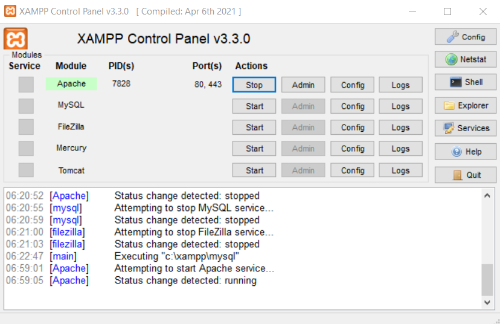
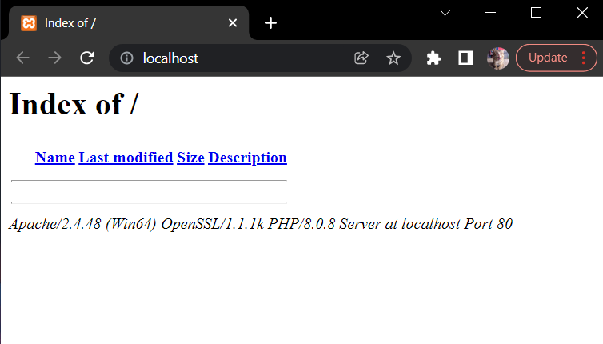
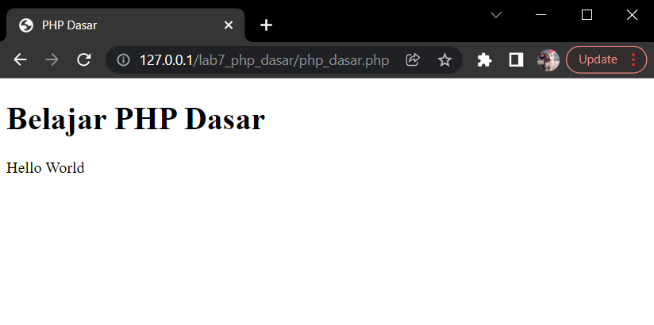
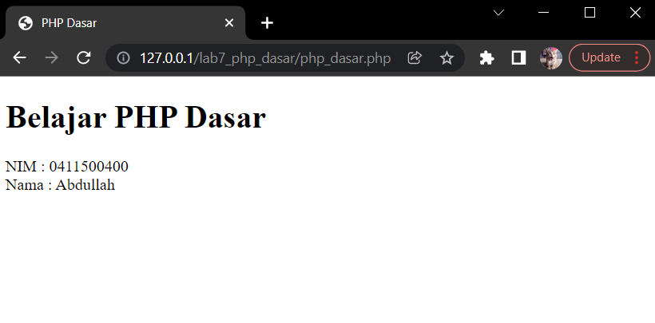
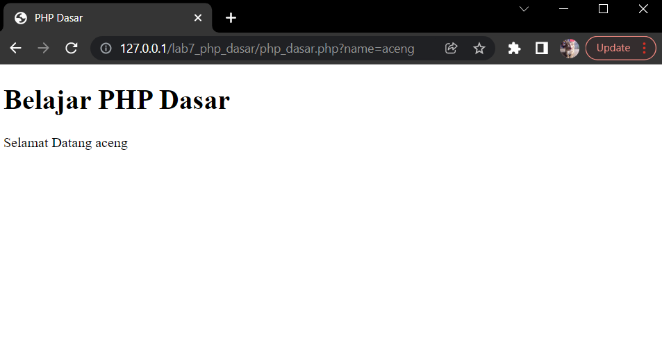
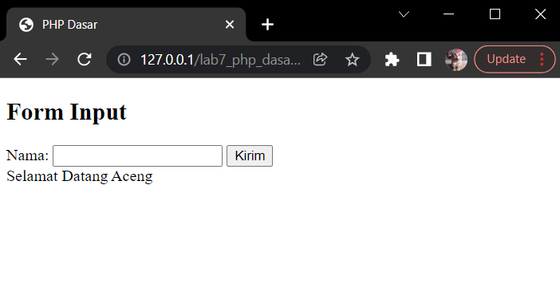
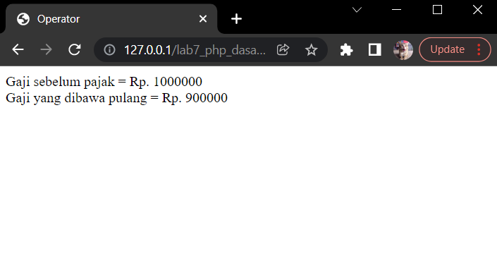

# :rocket: Latihan PHP Dasar

Made With :

- Nama : Hizbullah Ridwan
- NIM : 312110055
- Kelas : TI.21.B.1
- Mata Kuliah : Pemrograman Web

## Install XAMPP

Sebelum mulai latihan PHP, pertama adalah mendownload dan install [XAMPP](https://www.apachefriends.org/) terlebih dahulu sebagai aplikasi bundle web servernya. Download langsung pada websitenya yaitu `https://www.apachefriends.org/download.html` atau [klik disini](https://www.apachefriends.org/download.html).

## Run Web Server

Setelah berhasil download dan install, [XAMPP](https://www.apachefriends.org/) bisa langsung di run. Start apache module kemudian pergi ke localhost dengan mengakses `http://127.0.0.1` atau `http://localhost`.





## Create Folder and File

Pada document root, buat folder baru dengan nama `lab7_php_dasar` dan buat file `php_dasar.php` didalamnya. Secara default, document root letaknya ada di `C:\xampp\htdocs`.

## Hello World

Untuk membuat hello world pada PHP seperti ini :

```bash
<!DOCTYPE html>
<html lang="en">
  <head>
    <meta charset="UTF-8" />
    <title>PHP Dasar</title>
  </head>
  <body>
    <h1>Belajar PHP Dasar</h1>
    <?php
      echo "Hello World";?>
  </body>
</html>
```



## Variable

Untuk membuat variable pada PHP, harus menyertakan tanda `$` didepannya seperti ini :

```bash
<?php
    $nim = "0411500400";
    $nama = 'Abdullah';
    echo "NIM : " . $nim . "<br>"; echo "Nama : $nama";
?>
```



## Predefine Variable GET

Untuk membuat predefine variable dengan get adalah seperti ini :

```bash
<?php
    echo 'Selamat Datang ' . $_GET['name'];
?>
```

Dan untuk mengaksesnya, yaitu dengan menambahkan `?name=nama_saya` dibelakang URL nya.



## Create Form Input

Form input dibuat dengan HTML dan ditambah dengan method `post` untuk menampilkan hasil inputnya. Seperti ini :

```bash
<!DOCTYPE html>
<html lang="en">
  <head>
    <meta charset="UTF-8" />
    <title>PHP Dasar</title>
  </head>
  <body>
    <h2>Form Input</h2>
    <form method="post">
      <label>Nama: </label>
      <input type="text" name="nama" />
      <input type="submit" value="Kirim" />
    </form>
    <?php
      echo 'Selamat Datang ' . $_POST['nama'];?>
  </body>
</html>
```



## Operator

Operator pada PHP sama seperti pada bahasa pemrograman lainnya, ada penjumlahan, pengurangan, perkalian, pembagian, modulus dan lainnya. Seperti ini :

```bash
<!DOCTYPE html>
<html lang="en">
  <head>
    <meta charset="UTF-8" />
    <title>Operator</title>
  </head>
  <body>
    <?php
      $gaji = 1000000;
      $pajak = 0.1;
      $thp = $gaji - ($gaji*$pajak);
      echo "Gaji sebelum pajak = Rp. $gaji <br>";
      echo "Gaji yang dibawa pulang = Rp. $thp";?>
  </body>
</html>
```



## Conditional

Conditional pada PHP sama juga seperti bahasa pemrograman lainnya. Ada if, if-else dan juga switch.

### If

Contoh conditional if adalah seperti ini :

```bash
<?php
    $nama_hari = date("l");
    if ($nama_hari == "Sunday") {
    echo "Minggu";
    } elseif ($nama_hari == "Monday") {
    echo "Senin";
    } else {
    echo "Selasa";
    }
?>
```

### Switch

Contoh conditional menggunakan switch adalah seperti ini :

```bash
<?php
    $nama_hari = date("l");
    switch ($nama_hari) {
        case "Sunday":
        echo "Minggu";
        break;
        case "Monday":
        echo "Senin";
        break;
        case "Tuesday":
        echo "Selasa";
        break;
        default:
        echo "Sabtu";
    }
?>
```

## Loop

Perulangan atau loop pada PHP sama juga seperti bahasa pemrograman lainnya. Ada for loop, while loop, dan dowhile loop.

### For Loop

Contoh for loop adalah seperti ini :

```bash
<?php
    echo "Perulangan 1 sampai 10 <br />";
    for ($i=1; $i<=10; $i++) {
        echo "Perulangan ke: " . $i . '<br />';
    }
    echo "Perulangan Menurun dari 10 ke 1 <br />";
    for ($i=10; $i>=1; $i--) {
        echo "Perulangan ke: " . $i . '<br />';
    }
?>
```

### While Loop

Contoh while loop adalah seperti ini :

```bash
<?php
    echo "Perulangan 1 sampai 10 <br />";
    $i=1;
    while ($i<=10) {
        echo "Perulangan ke: " . $i . '<br />';
        $i++;
    }
?>
```

### Do While Loop

Contoh Do While Loop adalah seperti ini :

```bash
<?php
    echo "Perulangan 1 sampai 10 <br />";
    $i=1;
    do {
        echo "Perulangan ke: " . $i . '<br />';
        $i++;
    }
    while ($i<=10);
?>
```
